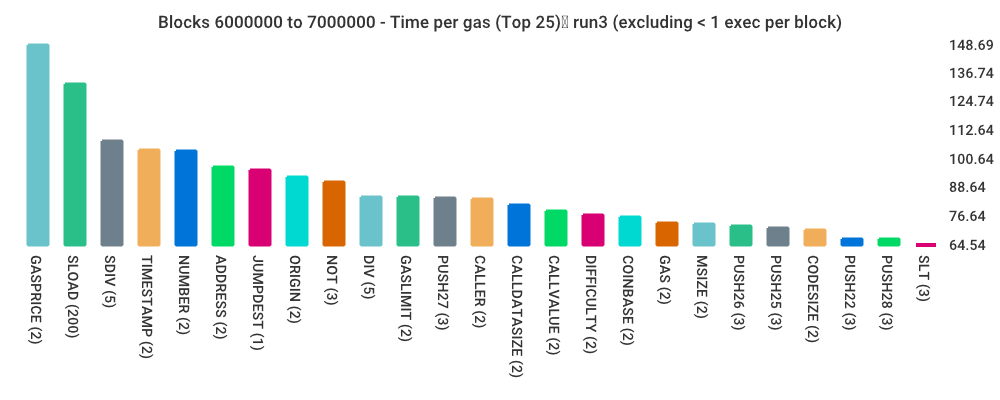
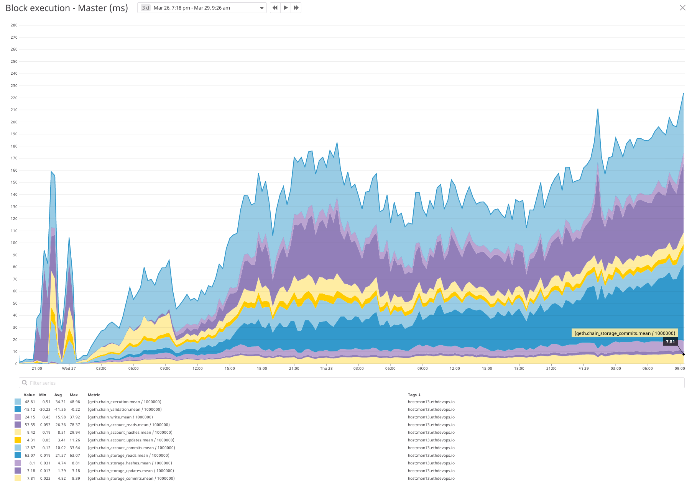

## Simple Summary

This EIP proposes repricing certain opcodes, to obtain a good balance between gas expenditure and resource consumption.

## Abstract

The growth of the Ethereum state has caused certain opcodes to be more resource-intensive at this point than 
they were previously. This EIP proposes to raise the `gasCost` for those opcodes.

## Motivation

An imbalance between the price of an operation and the resource consumption (CPU time, memory etc)
has several drawbacks:

- It could be used for attacks, by filling blocks with underpriced operations which causes excessive block processing time.
- Underpriced opcodes cause a skewed block gas limit, where sometimes blocks finish quickly but other blocks with similar gas use finish slowly.

If operations are well-balanced, we can maximise the block gaslimit and have a more stable processing time.

## Specification

At block `N`, 

- The `SLOAD` (`0x54`) operation changes from `200` to `800` gas,
- The `BALANCE` (`0x31`) operation changes from `400` to `700` gas,
- The `EXTCODEHASH` (`0x3F`) operation changes from `400` to `700` gas,
- A new opcode, `SELFBALANCE` is introduced at `0x47`. 
  - `SELFBALANCE` pops `0` arguments off the stack, 
  - `SELFBALANCE` pushes the `balance` of the current address to the stack,
  - `SELFBALANCE` is priced as `GasFastStep`, at `5` gas. 

## Rationale

Here are two charts, taken from a full sync using Geth. The execution time was measured for every opcode, and aggregated for 10K blocks. These bar charts show the top 25 'heavy' opcodes in the ranges 5M to 6M and 6M to 7M:

 
 

Note: It can also be seen that the `SLOAD` moves towards the top position. The `GASPRICE` (`0x3a`) opcode has position one which I believe can be optimized away within the client -- which is not the case with `SLOAD`/`BALANCE`.

Here is another chart, showing a full sync with Geth. It represents the blocks `0` to `5.7M`, and highlights what the block processing time is spent on.



It can be seen that `storage_reads` and `account_reads` are the two most significant factors contributing to the block processing time. 

### `SLOAD`

`SLOAD` was repriced at [EIP-150][eip-150], from `50` to `200`. 
The following graph shows a go-ethereum full sync, where each data point represents
 10K blocks. During those 10K blocks, the execution time for the opcode was aggregated.


It can be seen that the repricing at [EIP-150][eip-150] caused a steep drop, from around `67` to `23`. 
Around block `5M`, it started reaching pre-[EIP-150][eip-150] levels, and at block `7M` 
it was averaging on around `150` - more than double pre-eip-150 levels. 

Increasing the cost of `SLOAD` by `4` would bring it back down to around `40`. 
It is to be expected that it will rise again in the future, and may need future repricing, unless 
state clearing efforts are implemented before that happens. 

### `BALANCE` 

`BALANCE` (a.k.a `EXTBALANCE`) is an operation which fetches data from the state trie. It was repriced at [EIP-150][eip-150] from `20` to `400`.


It is comparable to `EXTCODESIZE` and `EXTCODEHASH`, which are priced at `700` already. 

It has a built-in high variance, since it is often used for checking the balance of `this`, 
which is a inherently cheap operation, however, it can be used to lookup the balance of arbitrary account which often require trie (disk) access. 

In hindsight, it might have been a better choice to have two 
opcodes: `EXTBALANCE(address)` and `SELFBALANCE`, and have two different prices. 

* This EIP proposes to extend the current opcode set.
  * Unfortunately, the opcode span `0x3X` is already full, hence the suggestion to place `SELFBALANCE` in the `0x4X` range.  
  * As for why it is priced at `5` (`GasFastStep`) instead of `2` (`GasQuickStep`), like other similar operations: the EVM execution engine still needs a lookup into the (cached) trie, and `balance`, unlike `gasPrice` or `timeStamp`, is not constant during the execution, so it has a bit more inherent overhead. 


### `EXTCODEHASH`

`EXTCODEHASH` was introduced in Constantinople, with [EIP-1052](https://eips.ethereum.org/EIPS/eip-1052). It was priced at `400` with the reasoning:

> The gas cost is the same as the gas cost for the `BALANCE` opcode because the execution of the `EXTCODEHASH` requires the same account lookup as in `BALANCE`.

Ergo, if we increase `BALANCE`, we should also increase `EXTCODEHASH`


## Backwards Compatibility

The changes require a hardfork. The changes have the following consequences:

- Certain calls will become more expensive.
- Default-functions which access the storage and may in some cases require more than`2300` gas (the minimum gas that is always available in calls). 
- Contracts that assume a certain fixed gas cost for calls (or internal sections) may cease to function.
  - A fixed gas cost is specified in [ERC-165](https://eips.ethereum.org/EIPS/eip-165) and implementations of this interface do use the affected opcodes.
  - However, these operations have already been repriced earlier, so there is a historical precedent that 'the gascost for these operations may change', which should have prevented such fixed-gas-cost assumptions from being implemented.

I expect that certain patterns will be less used, for example the use of multiple modifiers which `SLOAD`s the same opcode will be merged into one. It may also lead to less `log` operations containing `SLOAD`ed values that are not strictly necessary.

## Test Cases

Testcases that should be implemented: 
- Test that `selfbalance == balance(address)`, 
- Test that `balance(this)` costs as before, 
- Test that `selfbalance` does not pop from stack
- Gascost verification of `SLOAD`, `EXTCODEHASH` and `SELFBALANCE`
- Verify that `SELFBALANCE` is invalid before Istanbul

Some testcases have been implemented as statetests at https://github.com/holiman/IstanbulTests/tree/master/GeneralStateTests

## Implementation

This EIP has not yet been implemented in any client. 
Both these opcodes have been repriced before, and the client internals for managing reprices are already in place.

### `SELFBALANCE`

This is the implementation for the new opcode in go-ethereum:

```golang

func opSelfBalance(pc *uint64, interpreter *EVMInterpreter, contract *Contract, memory *Memory, stack *Stack) ([]byte, error) {
	stack.push(interpreter.intPool.get().Set(interpreter.evm.StateDB.GetBalance(contract.Address())
	return nil, nil
}

```

## Security considerations

- See backwards compatibility section. 
- There are no special edgecases regarding `SELFBALANCE`, if we define it as `BALANCE` with `address` instead of popping an address from the stack -- since `BALANCE` is already well-defined.
- It should be investigated if Solidity contains any hardcoded expectations on the gas cost of these operations.
- In many cases, a recipient of `ether` from a `CALL` will want to issue a `LOG`. The `LOG` operation costs `375` plus `375` per topic. If the `LOG` also wants to do an `SLOAD`, this change may make some such transfers fail. 

## Copyright
Copyright and related rights waived via [CC0](https://creativecommons.org/publicdomain/zero/1.0/).

[eip-150]: https://eips.ethereum.org/EIPS/eip-150
