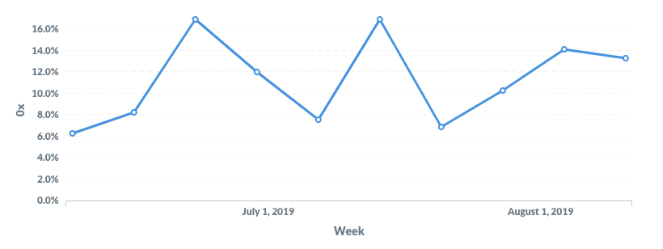
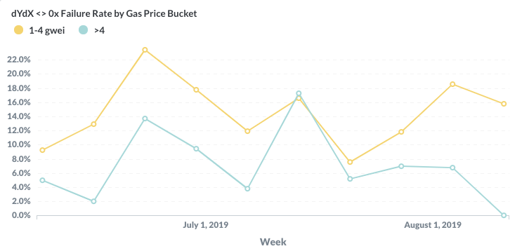

<!--You can leave these HTML comments in your merged EIP and delete the visible duplicate text guides, they will not appear and may be helpful to refer to if you edit it again. This is the suggested template for new EIPs. Note that an EIP number will be assigned by an editor. When opening a pull request to submit your EIP, please use an abbreviated title in the filename, `eip-draft_title_abbrev.md`. The title should be 44 characters or less.-->

## Simple Summary
<!--"If you can't explain it simply, you don't understand it well enough." Provide a simplified and layman-accessible explanation of the EIP.-->
A standard interface that allows a dApp to put a minimum or maximum gas price on a transaction, which Wallets will respect and not allow users to lower their gas price below or raise above, respectively. Users may still increase gas price for even faster transactions or lower the gas price for cheaper transactions, but will not be able to be able to go below the minimum or exceed the maximum.

## Abstract
<!--A short (~200 word) description of the technical issue being addressed.-->
Many dApps require certain transactions to be quickly mined in order to ensure a good user experience. In order to ensure that a transaction is mined quickly, dApps will suggest a reasonably-high gas price to give these transactions a high probability of being mined in the next block or two. Unfortunately, users will manually lower this gas price to save money, resulting in these transactions taking a long time or failing.

This EIP allows dApps to prevent less sophisticated users from accidentally hurting themselves and wasting money by setting their gas price too low, causing their transaction to never get mined or to fail because it’s time-sensitive in some way.

## Motivation
<!--The motivation is critical for EIPs that want to change the Ethereum protocol. It should clearly explain why the existing protocol specification is inadequate to address the problem that the EIP solves. EIP submissions without sufficient motivation may be rejected outright.-->
#### Background

With both the Ethereum JSON RPC interface, dApps are able to request that users sign an Ethereum transaction for interacting with their application. This transaction might be relatively high-priority or time-sensitive, such as trading assets on a DEX or opening a margin position on a lending protocol, or it might relatively low-priority and time-agnostic, such as voting on a governance proposal or depositing funds into a DAO. Users will usually set high gas prices for higher-importance transactions to incentivize miners to mine their transactions sooner, and set lower gas prices for lower-importance transactions to save money.

dApps are able to manage much of this for users by offering recommended gas prices when they request that users sign an Ethereum transaction. dApps will read current gas prices from services like ETH Gas Station (https://ethgasstation.info/), choose a gas price that is appropriate for a relatively-speedy transaction, and pre-fill it as a recommended gas price for users. Still, users are able to adjust this gas price, as well as the gas limit, in most wallets before signing and broadcasting the transaction.

While this optionality makes sense in scenarios where users might have different levels of cost-sensitivity — for example, if a governance is about to close and I need to get my vote in now vs. being able to wait an hour or two before my vote gets counted — it can create inadvertently terrible user experiences in scenarios where a transaction is time-sensitive, but a user is not aware of this fact. In these scenarios, a user will manually adjust their gas price down to an amount save money, but that prevents a transaction from getting mined in a reasonable amount of time, resulting in a transaction that is guaranteed to fail or take far longer than anticipated.

This can also break the dApp where a dev might e.g. need the user to deploy or contract or enable allowances before the dApp is usable. If the user sets too low of a gas price, the dApp will need to recognize this (not easy) and prompt the user to resubmit the transaction with a higher gas price (difficult and confusing).

#### Examples of the Problem

Ultimately, the problem boils down to being able to accurately estimate and understand on-chain state off-chain. Examples when this might be a problem include:

* Filling a set of 0x orders before they expire
* Creating a specific loan at a specific rate from Compound
* Bidding on a Cryptokitty in an auction before the auction ends or at a specific price
* Swapping tokens on Uniswap at a quoted rate

Specifically, at 0x, we saw this problem when looking at dY/dX usage of 0x liquidity to facilitate the creation of margin positions on its protocol.

Even though dY/dX set its recommended gas price for this transaction to the ETH Gas Station standard + 4 gwei (which is normally quite fast), they noticed that a large number of transactions were failing. What’s additionally surprising is that these transactions were failing because the 0x orders they were attempting to fill had expired, despite dY/dX giving users almost two minutes of time to fill orders before they expired.

*10 - 15% of dY/dX + 0x transactions were failing due to trying to fill expired orders.*

When looking more deeply at the failed transactions, we noticed that a very large number of them had a gas price of 1, and a similarly large number had a gas price < 4, which should be impossible as dY/dX was setting the gas price to 5 at a minimum. *Users were manually setting their gas price lower, resulting in failed transactions, wasted money, and a terrible UX.* We can verify this by looking at the massively higher failure rate for transactions with a gas price of <=4 and gas price of >4.

We need a way to prevent users — especially newer, less technical users — from hurting themselves and wasting money on transactions that are doomed to fail.

## Specification
<!--The technical specification should describe the syntax and semantics of any new feature. The specification should be detailed enough to allow competing, interoperable implementations for any of the current Ethereum platforms (go-ethereum, parity, cpp-ethereum, ethereumj, ethereumjs, and [others](https://github.com/ethereum/wiki/wiki/Clients)).-->
This EIP proposes a new JSON RPC method `eth_proposeTransaction` which wraps the `eth_sendTransaction` RPC method and introduces two optional new parameters, minGasPrice and maxGasPrice. These parameters are read and respected by wallets, which then call `eth_sendTransaction` with the newly signed transaction.

#### CURRENT

`eth_sendTransaction (https://github.com/ethereum/wiki/wiki/JSON-RPC#eth_sendtransaction)`

*Parameters*

1.`Object` - The transaction object

* `from: DATA, 20 Bytes` - The address the transaction is send from.
* `to: DATA, 20 Bytes` - (optional when creating new contract) The address the transaction is directed to.
* `gas: QUANTITY` - (optional, default: 90000) Integer of the gas provided for the transaction execution. It will return unused gas.
* `gasPrice: QUANTITY` - (optional, default: To-Be-Determined) Integer of the gasPrice used for each paid gas
* `value: QUANTITY` - (optional) Integer of the value sent with this transaction
* `data: DATA` - The compiled code of a contract OR the hash of the invoked method signature and encoded parameters. For details see Ethereum Contract ABI (https://github.com/ethereum/wiki/wiki/Ethereum-Contract-ABI)
* `nonce: QUANTITY` - (optional) Integer of a nonce. This allows to overwrite your own pending transactions that use the same nonce.

#### PROPOSED

`eth_proposeTransaction`
Intended to be used for locked nodes or web3 wallets, where a user must approve the transaction / unlock the node before the transaction can be signed and sent. A wrapper on top of `eth_sendTransaction`.

*Parameters*

1. `Object` - The transaction object

* `from: DATA, 20 Bytes` - The address the transaction is send from.
* `to: DATA, 20 Bytes` - (optional when creating new contract) The address the transaction is directed to.
* `gas: QUANTITY` - (optional, default: 90000) Integer of the gas provided for the transaction execution. It will return unused gas.
* `gasPrice: QUANTITY` - (optional, default: To-Be-Determined) Integer of the gasPrice used for each paid gas
* `minGasPrice: QUANTITY` (optional, default: 0) Integer of the minimum gas price to be allowed for this transaction. Must be greater or equal to and 0 and less than or equal to maxGasPrice if it is set.
* `maxGasPrice: QUANTITY` (optional) Integer of the maximum gas price to be allowed for this transaction. Must be greater than or equal to minGasPrice if it is set.
* `value: QUANTITY` - (optional) Integer of the value sent with this transaction
* `data: DATA` - The compiled code of a contract OR the hash of the invoked method signature and encoded parameters. For details see Ethereum Contract ABI (https://github.com/ethereum/wiki/wiki/Ethereum-Contract-ABI)
* `nonce: QUANTITY` - (optional) Integer of a nonce. This allows to overwrite your own pending transactions that use the same nonce.

## Rationale
<!--The rationale fleshes out the specification by describing what motivated the design and why particular design decisions were made. It should describe alternate designs that were considered and related work, e.g. how the feature is supported in other languages. The rationale may also provide evidence of consensus within the community, and should discuss important objections or concerns raised during discussion.-->
Before opening this EIP, we talked with a number of dApp teams about changing the design of their interface to encourage users to not adjust gas price. While this approach could potentially show some improvement, it’s suboptimal for a number of reasons:

* It requires each dApp team to change their own interface, creating duplicated work and tech debt.
* It requires users to notice and understand the new warning against changing gas price, which reduces this solution’s efficacy.
* It does not enforce this gas price constraints, and instead simply suggests the changes. This means that users are still able to adjust gas price and create unusable transactions.

The proposed approach requires a minimal change to the Ethereum JSON RPC interface by adding an optional parameter for wallets to observe and respect.

## Backwards Compatibility
<!--All EIPs that introduce backwards incompatibilities must include a section describing these incompatibilities and their severity. The EIP must explain how the author proposes to deal with these incompatibilities. EIP submissions without a sufficient backwards compatibility treatise may be rejected outright.-->
All EIPs that introduce backwards incompatibilities must include a section describing these incompatibilities and their severity. The EIP must explain how the author proposes to deal with these incompatibilities. EIP submissions without a sufficient backwards compatibility treatise may be rejected outright.

## Test Cases
<!--Test cases for an implementation are mandatory for EIPs that are affecting consensus changes. Other EIPs can choose to include links to test cases if applicable.-->
N/A

## Implementation
<!--The implementations must be completed before any EIP is given status "Final", but it need not be completed before the EIP is accepted. While there is merit to the approach of reaching consensus on the specification and rationale before writing code, the principle of "rough consensus and running code" is still useful when it comes to resolving many discussions of API details.-->
TBD

## Copyright
Copyright and related rights waived via [CC0](https://creativecommons.org/publicdomain/zero/1.0/).
