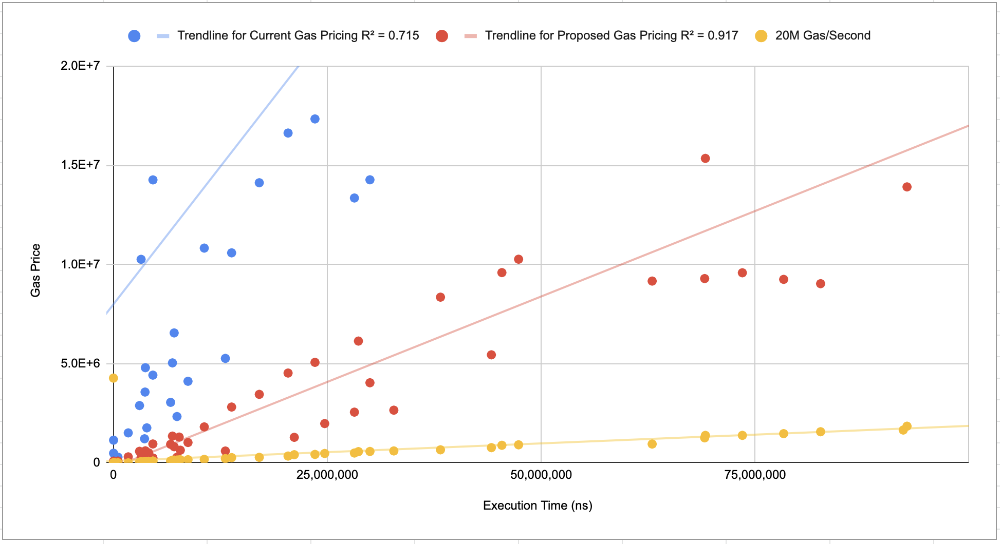

## Simple Summary
The [EIP-198](https://eips.ethereum.org/EIPS/eip-198) ‘big integer modular exponentiation’, or `ModExp`, precompile is currently overpriced. Re-pricing this precompile will enable more cost efficient verification of RSA signatures, verifiable delay functions (VDFs), primality checks, and more.

## Abstract
After benchmarking the ModExp precompile, we discovered that it is ‘overpriced’ relative to other precompiles. We also discovered that the current gas pricing formula could be improved to better estimate the computational complexity of various ModExp input variables. 
To improve the gas cost pricing for this precompile, this EIP specifies

* Changing the value of the `GQUADDIVISOR` parameter in the ModExp pricing formula to bring its costs more in-line with other precompiles

## Motivation
Modular exponentiation is a foundational arithmetic operation for many cryptographic functions including signatures, VDFs, SNARKs, accumulators, and more. Unfortunately, the ModExp precompile is currently over-priced, making these operations inefficient and expensive. By reducing the cost of this precompile, these cryptographic functions become more practical, enabling improved security, stronger randomness (VDFs), and more.

## Specification

The current gas pricing formula is defined in [EIP-198](eip-198.md) as: 

```
floor(mult_complexity(max(length_of_MODULUS, length_of_BASE)) * max(ADJUSTED_EXPONENT_LENGTH, 1) / GQUADDIVISOR)
```

At `fork_block`, 
 - set `GQUADDIVISOR` to `200`.


## Rationale

With this change, the cost of the ModExp precompile will have a higher cost (gas/second) than other precompiles such as ECRecover.



## Test Cases

There are no changes to the underlying interface or arithmetic algorithms, so the existing test vectors can be reused. Gas values will need to be updated in the existing unit tests based on the final pricing decided in this EIP. This will ensure that the updated gas calculations are done correctly.

Existing testvectors from [go-ethereum](https://github.com/ethereum/go-ethereum/blob/master/core/vm/testdata/precompiles/modexp.json):

| testcase | EIP-198 gas| 2565 opt  1 gas| 2565 opt 2 gas | 
| -|--|--|--
|modexp_nagydani_1_square| 204 | 100| 100?|

TODO fill this table

## Security Considerations

The biggest security consideration for this EIP is creating a potential DoS vector by making ModExp operations too inexpensive relative to their computation time.

To address this, clients should perform benchmarking to ensure that gas limits are not causing DoS problems. 

## References
[EIP-198](https://eips.ethereum.org/EIPS/eip-198) 

## Copyright
Copyright and related rights waived via [CC0](https://creativecommons.org/publicdomain/zero/1.0/).

## Appendix

### Abandoned option : Modify ‘computational complexity’ function and add minimum gas cost

The current complexity function, as defined in EIP-198 is as follow:

```
def mult_complexity(x):
    if x <= 64: return x ** 2
    elif x <= 1024: return x ** 2 // 4 + 96 * x - 3072
    else: return x ** 2 // 16 + 480 * x - 199680
```
where is `x` is `max(length_of_MODULUS, length_of_BASE)`

This complexity formula was meant to approximate the difficulty of Karatsuba multiplication. However, we found a better approximation for modelling modular exponentiation. We recommend the following formula to better estimate the computational complexity for varying input values:

```
def mult_complexity(x):
    ceiling(x/64)^2
```
where is `x` is `max(length_of_MODULUS, length_of_BASE)`. `x` is divided by 64 to account for the number of limbs in multiprecision arithmetic.

You can find comparison of these two complexity fomulas for the current test vectors as the following [spreadsheet](https://docs.google.com/spreadsheets/d/1-xBzA-2-l2ZQDQ1eh3XXGZjcRSBQ_Hnp7NubXpbiSUY/edit?usp=sharing).

In addition to modifying the `mult_complexity` formula as above, we also recommend wrapping the entire function with a minimum gas price of 100 to ensure that a minimum amount of gas is used when the precompile is called e.g. `max(100,floor(mult_complexity(x)/GQUADDIVISOR))`

#### Rationale

A comparison of the current ‘complexity’ function and the proposed function described above can be found at the following [spreadsheet](https://docs.google.com/spreadsheets/d/1-xBzA-2-l2ZQDQ1eh3XXGZjcRSBQ_Hnp7NubXpbiSUY/edit?usp=sharing).


The new complexity function has a better fit vs. the execution time when compared to the current complexity function. This better fit is because the new complexity formula accounts for the use of binary exponentiation algorithms that are used by ‘bigint’ libraries for large exponents. You may also notice the regression line of the proposed complexity function bisects the test vector data points. This is because the run time varies depending on if the modulus is even or odd.
