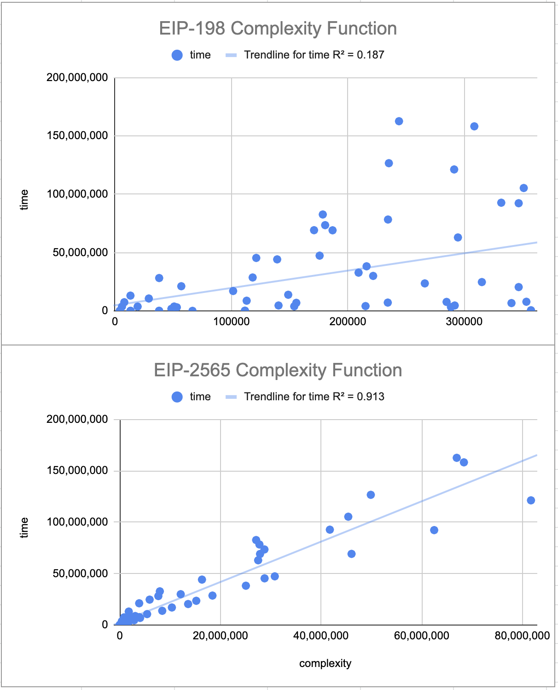

## Simple Summary
This EIP reprices the [EIP-198](./eip-198.md) ‘big integer modular exponentiation’, or `ModExp`, precompile.

## Abstract
To improve the gas cost pricing of the `ModExp` precompile, this EIP specifies:

1. A change to the `mult_complexity` formula to better reflect the computational complexity of ModExp operations
2. A change to the value of the `GQUADDIVISOR` parameter in the ModExp pricing formula to bring its costs in-line with other precompiles
3. A minimum cost to call the precompile to prevent underpricing for small inputs

## Motivation
Modular exponentiation is a foundational arithmetic operation for many cryptographic functions including signatures, VDFs, SNARKs, accumulators, and more. Unfortunately, the ModExp precompile is currently over-priced, making these operations inefficient and expensive. By reducing the cost of this precompile, these cryptographic functions become more practical, enabling improved security, stronger randomness (VDFs), and more.

## Specification
The current gas pricing formula is defined in [EIP-198](./eip-198.md) as follows: 

```
floor(mult_complexity(max(length_of_MODULUS, length_of_BASE)) * max(ADJUSTED_EXPONENT_LENGTH, 1) / GQUADDIVISOR)
```

As of `FORK_BLOCK_NUMBER` make the following changes to the pricing formula for the ModExp precompile:

### 1: Modify the `mult_complexity` function
Replace the `mult_complexity` functon with the following formula to better estimate the computational complexity for varying input values:

```
def mult_complexity(x):
    ceiling(x/8)^2
```
where is `x` is `max(length_of_MODULUS, length_of_BASE)`. 

### 2. Update value of `GQUADDIVISOR`
Update the value of `GQUADDIVISOR` to `3`.

### 3. Set a minimum price for calling the precompile
Wrap the function to ensure a minimum gas price of `200`, i.e:
 `
max(200,floor(mult_complexity(max(length_of_MODULUS, length_of_BASE)) * max(ADJUSTED_EXPONENT_LENGTH, 1) / GQUADDIVISOR))
`

## Rationale
After benchmarking the ModExp precompile, we discovered that it is ‘overpriced’ relative to other precompiles. We also discovered that the current gas pricing formula could be improved to better estimate the computational complexity of various ModExp input variables. The following changes improve the accuracy of the `ModExp` pricing:

### 1. Modify ‘computational complexity’ formula to better reflect the computational complexity
The current complexity function, as defined in EIP-198 is as follow:

```
def mult_complexity(x):
    if x <= 64: return x ** 2
    elif x <= 1024: return x ** 2 // 4 + 96 * x - 3072
    else: return x ** 2 // 16 + 480 * x - 199680
```
where is `x` is `max(length_of_MODULUS, length_of_BASE)`

This complexity formula was meant to approximate the difficulty of Karatsuba multiplication. However, we found a better approximation for modelling modular exponentiation. In the new complexity formula `x` is divided by 8 to account for the number of limbs in multiprecision arithmetic. A comparison of the current ‘complexity’ function and the proposed function against the execution time can be seen below:



The new complexity function has a better fit vs. the execution time when compared to the current complexity function. This better fit is because the new complexity formula accounts for the use of binary exponentiation algorithms that are used by ‘bigint’ libraries for large exponents. You may also notice the regression line of the proposed complexity function bisects the test vector data points. This is because the run time varies depending on if the modulus is even or odd.

### 2. Change the value of GQUADDIVISOR
After changing the 'computational complexity' formula it is necessary to change `QGUADDIVSOR` to bring the gas costs inline with their runtime. We recommend changing the value from '20' to '3'. With this change, the cost of the ModExp precompile will have a higher cost (gas/second) than other precompiles such as ECRecover.


### 3. Set a minimum gas cost to prevent abuse
This prevents the precompile from underpricing small input values.

## Test Cases
There are no changes to the underlying interface or arithmetic algorithms, so the existing test vectors can be reused. Below is a table with the updated test vectors:

| Test Case  | EIP-198 Pricing | New Pricing |
| ------------- | ------------- | ------------- |
| modexp_nagydani_1_square | 204  | 200  |
| modexp_nagydani_1_qube | 204  | 200  |
| modexp_nagydani_1_pow0x10001 | 3276  | 341  |
| modexp_nagydani_2_square  | 665  | 200  |
| modexp_nagydani_2_qube  | 665  | 200  |
| modexp_nagydani_2_pow0x10001  | 10649  | 1365  |
| modexp_nagydani_3_square  | 1894  | 341  |
| modexp_nagydani_3_qube  | 1894  | 341  |
| modexp_nagydani_3_pow0x10001  | 30310  | 5461  |
| modexp_nagydani_4_square  | 5580  | 1365  |
| modexp_nagydani_4_qube  | 5580  | 1365  |
| modexp_nagydani_4_pow0x10001  | 89292  | 21845  |
| modexp_nagydani_5_square  | 17868  | 5461  |
| modexp_nagydani_5_qube  | 17868  | 5461  |
| modexp_nagydani_5_pow0x10001  | 285900 | 87381  |

## Security Considerations
The biggest security consideration for this EIP is creating a potential DoS vector by making ModExp operations too inexpensive relative to their computation time.

## Implementations
[Geth](https://github.com/ethereum/go-ethereum/pull/21607)

## Copyright
Copyright and related rights waived via [CC0](https://creativecommons.org/publicdomain/zero/1.0/).
