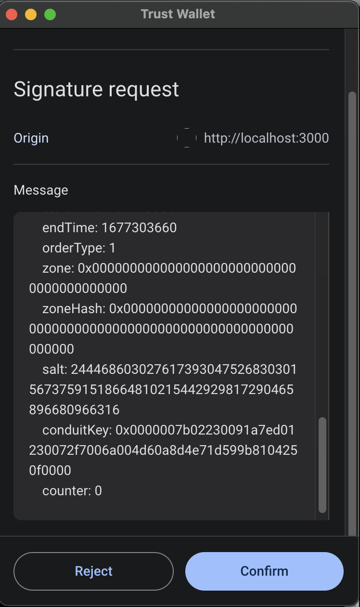
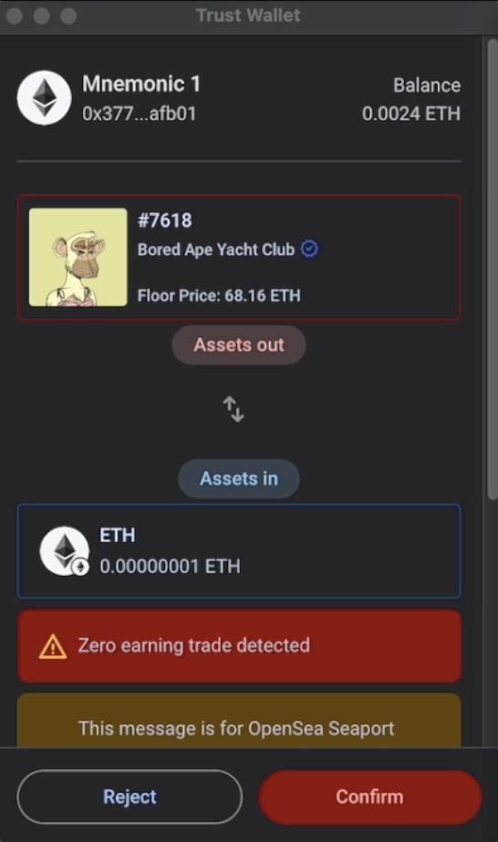

## Abstract

Numerous protocols employ distinct EIP-712 schemas, leading to unavoidable inconsistencies across the ecosystem. To address this issue, we propose a standardized approach for dApps to implement an on-chain view function called `visualizeEIP712Message`. This function takes an abi encoded EIP-712 payload message as input and returns a universally agreed-upon structured data format that emphasizes the potential impact on users' assets. Wallets can then display this structured data in a user-friendly manner, ensuring a consistent experience for end-users when interacting with various dApps and protocols.

## Motivation

The rapid expansion of the web3.0 ecosystem has unlocked numerous opportunities and innovations. However, this growth has also heightened users' vulnerability to security threats, such as phishing scams. Ensuring that users have a comprehensive understanding of the transactions they sign is crucial for mitigating these risks.

In an attempt to address this issue, we developed an in-house, open-source off-chain SDK for wallets to visualize various protocols. However, we encountered several challenges along the way:

- Scalability: Identifying and understanding all protocols that utilize EIP-712 and their respective business logic is a daunting task, particularly with limited resources. Crafting an off-chain solution for all these protocols is nearly impossible.
- Reliability: Grasping each protocol's business logic is difficult and may lead to misunderstandings of the actual implementation. This can result in inaccurate visualizations, which could be more detrimental than providing no visualization at all.
- Maintainability: Offering support for protocols with an off-chain solution is insufficient in a rapidly evolving ecosystem. Protocols frequently upgrade their implementations by extending features or fixing bugs, further complicating the maintenance process.

To overcome these challenges, we propose a standardized, on-chain solution that can accommodate the diverse and ever-changing web3.0 ecosystem. This approach would enhance scalability, reliability, and maintainability by shifting the responsibility of visualizing EIP-712 payloads from the wallets to the protocols themselves. Consequently, wallets can use a consistent and effective approach to EIP-712 message visualization.

The adoption of a universal solution will not only streamline the efforts and reduce the maintenance burden for wallet providers, but it will also allow for faster and more extensive coverage across the ecosystem. This will ultimately result in users gaining a clearer understanding of the transactions they're signing, leading to increased security and an improved overall user experience within the crypto space.

currently, most of the wallets display something similar to image below



with visualization we can achieve something similar to image below where more insightful details are revealed to user thanks to the structured data returned from the EIP



## Specification

The key words "MUST", "MUST NOT", "REQUIRED", "SHALL", "SHALL NOT", "SHOULD", "SHOULD NOT", "RECOMMENDED", "NOT RECOMMENDED", "MAY", and "OPTIONAL" in this document are to be interpreted as described in RFC 2119 and RFC 8174.

Each new protocol that uses eip-712 MUST include the `visualizeEIP712Message` function in the  `verifyingContract` implementation

```solidity
/**
* @notice This function processes an EIP-712 payload message and returns a structured data format emphasizing the potential impact on users' assets.
* @dev The function returns assetsOut (assets the user is offering), assetsIn (assets the user would receive), and liveness (validity duration of the EIP-712 message).
* @param encodedMessage The ABI-encoded EIP-712 message (abi.encode(types, params)).
* @param domainHash The hash of the EIP-712 domain separator as defined in the EIP-712 proposal; see https://eips.ethereum.org/EIPS/eip-712#definition-of-domainseparator.
* @return Result struct containing the user's assets impact and message liveness.
*/
function visualizeEIP712Message(
    bytes memory encodedMessage,
    bytes32 domainHash
) external view returns (Result memory);
```
### Params

`encodedMessage` is bytes that represents the encoded EIP-712  message with `abi.encode` and it can be decoded using `abi.decode`

`domainHash` is the bytes32 hash of the EIP-712 domain separator as defined in the EIP-712 proposal

### Outputs

The function MUST returns Result ; a struct that contains information's about user’s assets impact and the liveness of such a message if get signed.

```solidity
struct Liveness {
  uint256 from;
	uint256 to;
}

struct UserAssetMovement {
	address assetTokenAddress;
  uint256 id;
  uint256[] amounts;
}

struct Result {
  UserAssetMovement[] assetsIn;
  UserAssetMovement[] assetsOut;
  Liveness liveness;
}
```

#### Liveness

`liveness` is a struct that defines the timestamps which the message is valid where:

- `from` is the starting timestamp.
- `to` is the expiry timestamp
- `from` MUST be less than `to`

#### UserAssetMovement

`UserAssetMovement` defines the user’s asset where:

- `assetTokenAddress` is the token (ERC20, ERC721, ERC1155) smart contract address where the zero address MUST represents the Native coin (Native ETH in the case of Ethereum network).
- `id` is the NFT ID, this item MUST ignored if the asset is not an NFT
    - if token with `id` doesn’t exist in an NFT collection, this SHOULD be considered as any token within that collection
- `amounts` is an Array of `uint256` where items MUST define the amount per time curve, with time defined within liveness boundaries
    - the first amount in `amounts` Array (amounts[0]) MUST be the amount of the asset at `liveness.from` timestamp
    - the last amount in `amounts` Array (amounts[amounts.length-1]) MUST be the amount of the asset at `liveness.to` timestamp
    - in most of the cases, `amounts` will be an Array with a single item which is MUST be the minimum amount of the asset.

#### assetsIn

`assetsIn` are the minimum assets which the user MUST get if the message is signed and fulfilled

#### assetsOut

`assetsOut` are the maximum assets which the user MUST offer if the message is signed and fulfilled

## Rationale

### on-chain

One might argue that certain processes can be done off-chain, which is true, but our experience building an off-chain TypeScript SDK to solve this matter revealed some issues:

- Reliability: Protocols developers are the ones responsible for developing the protocol itself, thus crafting the visualization is much more accurate when done by them.
- Scalability: Keeping up with the rapidly expanding ecosystem is hard. Wallets or 3rd party entities must keep an eye on each new protocol, understand it carefully (which poses the reliability issues mentioned above), and then only come up with an off-chain implementation.
- Maintainability: Many protocols implement smart contracts in an upgradable manner. This causes the off-chain visualization to differ from the real protocol behaviors (if updated), making the solution itself unreliable and lacking the scalability to handle various protocols.

### DomainHash

The `domainHash` is much needed by protocols to revert against unsupported versions of its EIP-712 implementation. It identifies the needed implementation in case the protocol implements various EIP-712 implementations (`name`) or to revert if the `domainHash` belongs to a different protocol.

In the future, if there is a registry that reroutes this EIP implementation for already deployed protocols that can't upgrade the existing deployed smart contract, `domainHash` can be used to identify protocols.

### Amounts Array

We suggest using an array of amounts (uint256[]) instead of a single uint256 to cover auctions, which are common in NFT protocols.

## Backwards Compatibility

No backward compatibility issues found.

## Reference Implementation

openSea Seaport NFT marketplace implementation example is available [here](../assets//eip-6811/contracts/SeaPortEIP712Visualizer.sol)

## Security Considerations

`visualizeEIP712Message` function should be reliable and accurately represent the potential impact of the EIP-712 message on users' assets. Wallet providers and users must trust the protocol's implementation of this function to provide accurate and up-to-date information.

## Copyright

Copyright and related rights waived via [CC0](../LICENSE.md).
