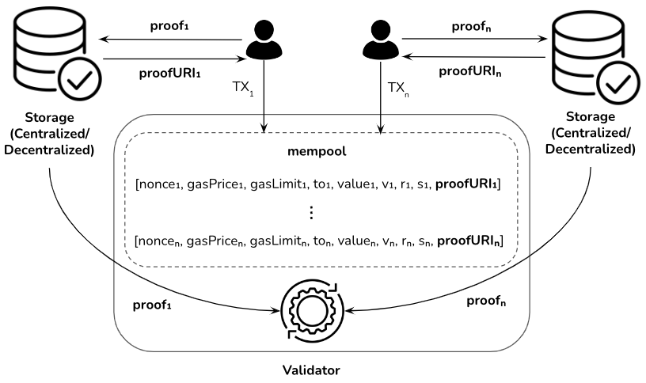
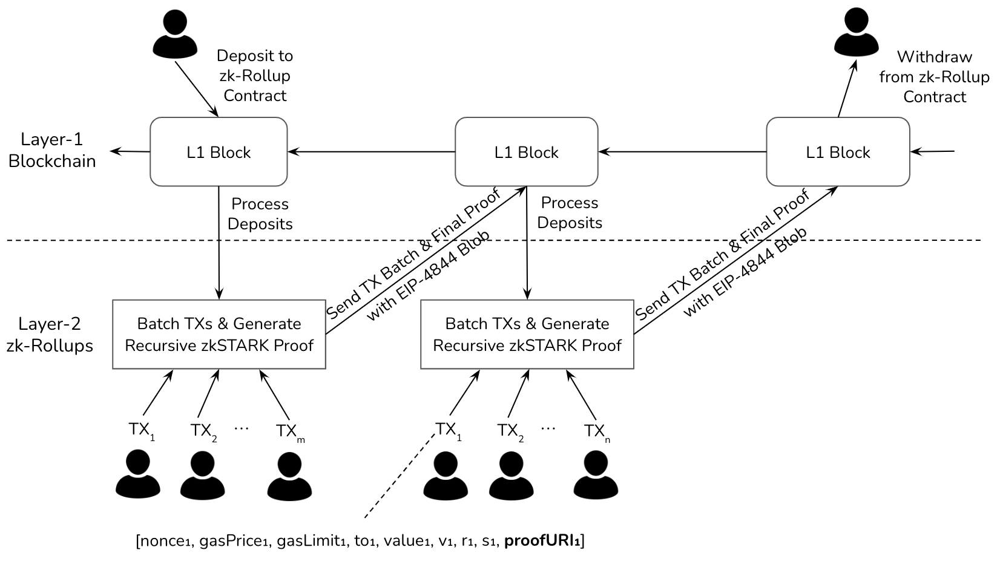
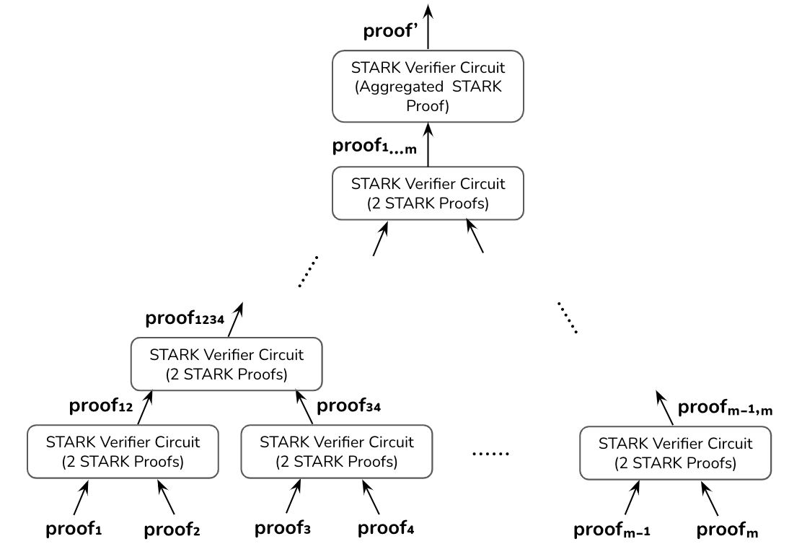
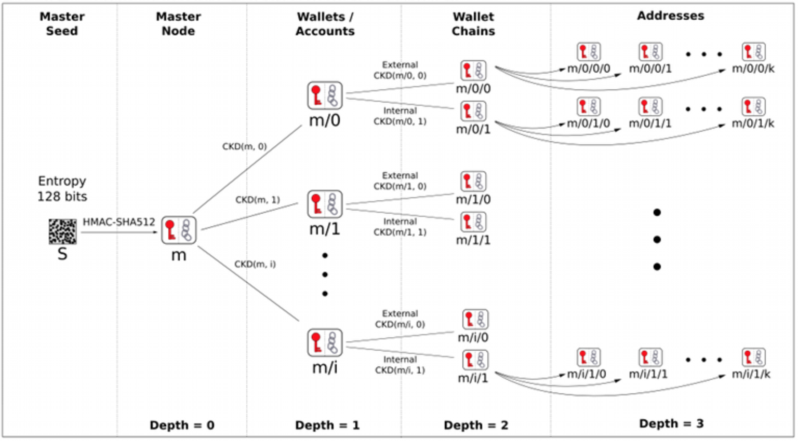

## Abstract

This Ethereum Improvement Proposal (EIP) presents a solution for integrating a post-quantum signature scheme into the Ethereum blockchain while maintaining backward compatibility with the existing Elliptic Curve Digital Signature Algorithm (ECDSA). With the rise of quantum computing, the security of ECDSA-based cryptographic signatures may be compromised in the future, necessitating the adoption of post-quantum cryptography (PQC) solutions. This proposal suggests the integration of a specific PQC signature scheme, ensuring the long-term security of Ethereum transactions against quantum attacks without requiring immediate upgrades to existing infrastructure. The proposed scheme aims to provide a seamless transition path for Ethereum users and developers while enhancing the overall security of the network in the face of evolving cryptographic threats.

## Motivation

Ethereum relies on ECDSA to protect transactions and data sent from wallets to nodes. Each wallet contains the private ECDSA key which must be kept secret as it can be used to create a digital signature to affect the transfer of assets out of the wallet. The blockchain nodes will rely on the corresponding public ECDSA key to verify the validity of the digital signature. The value of the public ECDSA key also determines the unique address of the wallet for identification purposes.

Quantum computers, when powerful enough, can be used to break cryptography used in Ethereum. Specifically, using Shor's algorithm on a cryptographically-relevant quantum computer (CRQC), an attacker will be able to create an exact copy of the private ECDSA key when given the public ECDSA key without needing access to the wallet. This will essentially allow the attacker to steal assets associated with any wallet on Ethereum.

In order to ensure Ethereum continues to operate as a trusted decentralized platform for users and organizations to transact, the threat of quantum computers needs to be mitigated. Vitalik Buterin also wrote a post on 9 March 2024 titled "How to hard-fork to save most users’ funds in a quantum emergency" on the mitigation of the quantum threat on Ethereum ecosystem. Estimates on when a CRQC will be available range from 2028 to 2040.

## Specification

The key words "MUST", "MUST NOT", "REQUIRED", "SHALL", "SHALL NOT", "SHOULD", "SHOULD NOT", "RECOMMENDED", "NOT RECOMMENDED", "MAY", and "OPTIONAL" in this document are to be interpreted as described in RFC 2119 and RFC 8174.

The digital signing system is typically made up of 3 operations:

- Key Generation: This is performed in the wallet, where a sequence of mnemonic words (or seed phrase) $`W`$ are randomly generated, and computationally derived through a hashing process to obtain a private key $`K_{prv}`$, a public key $`K_{pub} = \textsf{ECDSA}_{pubkey}(K_{prv})`$ and wallet address $`Addr = \textsf{Hash}(K_{pub})`$. $`K_{prv}`$ needs to be stored securely by the wallet while $`K_{pub}`$ and $`Addr`$ can be subsequently derived from $`K_{prv}`$.
- Signature Generation: This is performed in the wallet. Given the transaction, $`T`$, the wallet computes digital signature $`\delta = \textsf{ECDSA}_{sign}(T,K_{prv})`$ as proof-of-possession of $`K_{prv}`$. The package sent by the wallet to effect the transaction includes $`T`$, $`\delta`$, $`K_{pub}`$.
- Signature Verification: Signature verification is perform on the Ethereum node to check that the requested transaction is valid. The node computes $`\textsf{ECDSA}_{verify}(T,\delta,K_{pub})`$ to confirm that $`T`$ was never modified from the point it was digitally signed, and the private signing key used corresponds to the public key $`K_{pub}`$ and address $`\textsf{Hash}(K_{pub})`$.

We assume that in the future, an attacker with a CRQC will be able to know all $`K_{prv}`$ when given $`K_{pub}`$. Yet, we also know that hashing is resistant to CRQC attacks which means that the attacker will not be able to compute $`W`$, given $`K_{prv}`$, as long as $`W`$ is sufficiently large (i.e., 16-20 words).

We therefore propose to enhance the digital signing system for Ethereum to include a quantum-safe proof-of-knowledge ($`\textsf{QSPoK}`$) of $`W`$ to ensure that the security of the transactions cannot be compromised by a quantum computer. The digital signing system is to be updated as follows:

- Key Generation: No change to the Key Generation process. However, $`W`$ is stored in addition to $`K_{prv}`$.
- Signature Generation: We propose that the digital signature will now comprise of 2 parts:
 i) Digital signing. This is unchanged, i.e., $`\delta = \textsf{ECDSA}_{sign}(T,K_{prv})`$.
 ii) Proof generation. We propose a quantum-safe zero-knowledge proof system $`\pi = \textsf{QSPoK}_{prove}(T,W)`$ as proof-of-knowledge of $`W`$. This proof $`\pi`$ is unique with respect to $`T`$ and $`W`$, and forms part of the quantum-safe signature process.
- Signature Verification: The signature verification is also performed in two steps
 i) ECDSA Signature verification is unchanged, i.e., $`\textsf{ECDSA}_{verify}(T,\delta,K_{pub})`$
 ii) Proof validation to confirm that the signer knows the value of $`W`$ is added, i.e., $`\textsf{QSPoK}_{validate}(T,\pi,\delta,K_{pub})`$.

### Quantum-safe Proof-of-Knowledge

To implement $`\pi = \textsf{QSPoK}_{prove}(T,W)`$ and $`\textsf{QSPoK}_{validate}(T,\pi,\delta,K_{pub})`$, we need to use a quantum-safe zero-knowledge proof system such as Zero-Knowledge Scalable Transparent Argument of Knowledge (zkSTARK) or MPC-in-the-Head (MPCitH):

- zkSTARK. zkSTARK is a proof system that relies on an underlying collision-resistant hash primitive to assert the soundness of a certain mathematical claim. zkSTARK proofs require to create an arithmetic representation of the hash computation, obtain the interactive oracle proofs (IOP) and then use Fast Reed-Solomon IOP of Proximity (FRI) to optimize the proof.
- MPCitH. MPCitH has been studied extensively when it (under codename "Picnic") was submitted as part of the National Institute of Science and Technology (NIST) Post-Quantum Cryptography project. Picnic is based on symmetric key primitives which makes it provably secure under both ROM and QROM assumptions. Picnic reached the round 3 of the PQC project, but was ultimately dropped due to the large signature size which did not meet NIST's criteria. It is efficient as a zero-knowledge proof implementation for boolean circuits which hash algorithms such as SHA256, SHA512 and Keccak32 are based on.

## Rationale

We want to achieve a backward-compatible post-quantum migration process for Ethereum without the need for a hard-fork, and without forcing users to change their wallet addresses.

### NIST PQC

The current industry standard for mitigating the threat of quantum computers is to use post-quantum cryptography (PQC). The National Institute of Standards and Technology (NIST) has recommended 3 digital signature algorithms, namely Dilithium, Falcon and SPHINCS+, that can be used in place of ECDSA, to prevent attackers from being able to compromise digital signatures.

As wallet addresses are determined by the public ECDSA key, replacing ECDSA as the digital signing algorithm in Ethereum via a hard-fork will require all users to regenerate their private keys, update their smartcontracts, and re-establish peer-to-peer arrangements for the new addresses. All assets will need to be transferred out of existing ECDSA-based wallets prior to the hard-fork, except for soul-bound tokens which may no longer be usable.

As compared to the proposed Quantum-Safe Proof-of-knowledge of $`W`$, we expect using the NIST PQC algorithms to be highly disruptive to many Ethereum users, and fraught with possible fraudsters who may try to take advantage of this change.

### Proof Circuits

To be compatible to existing wallet standards ([BIP 32](https://github.com/bitcoin/bips/blob/a3a397c82384220fc871852c809f73898a4d547c/bip-0032.mediawiki), [BIP 39](https://github.com/bitcoin/bips/blob/66a1a8151021913047934ebab3f8883f2f8ca75b/bip-0039.mediawiki) and [BIP 44](https://github.com/bitcoin/bips/blob/c6e8351583718af6a49dc1780a825ae027b52b7b/bip-0044.mediawiki)) which use HMAC-SHA512 to compute $`K_{prv}`$ from $`W`$, the proof circuit needed would be $`\textsf{ECDSA}(trunc(\textsf{SHA512}(secret)),message)`$ where $`trunc(\textsf{SHA512}(secret)`$ will obtain $`K_{prv}`$ and $`\textit{message}`$ is the transaction to be signed. It is potentially a large circuit requiring high computational overheads for proof-generation and proof-validation, as well as a large proof size that is transmitted and stored.

We propose 2 authentication proof circuits to be supported:

- $`\textit{SHA512-compatible}`$. This is for users whose wallets are still based on the BIP0039 seed phrase, and require to authenticate their transactions to the verifying nodes. These users will will continue to use the $`\textsf{ECDSA}(trunc(\textsf{SHA512}(secret)),message)`$ proof-circuit. Preliminary proof size estimates for this circuit using MPCitH is 850KBytes. We expect the proof size for zkSTARK to be similar.
- $`\textit{qsECDSA}`$. This is for users who have generated their seed phrase after the upgrade. We can use an optimized proof-circuit to reduce the computational overheads and proof size. A possibility would be to use a zero-knowledge proof-friendly hash such as MiMC (or Rescue from the paper "STARK Friendly Hash -- Survey and Recommendation" by Eli Ben-Sasson et al) in place of SHA512. e.g., $`\textsf{ECDSA}(trunc(\textsf{MiMC}(secret)),message)`$[^1]

[^1]:
    ```csl-json
    {
      "type": "paper-conference",
      "id": 1,
      "author": [
        {
          "family": "Albrecht",
          "given": "Martin"
        }
      ],
      "DOI": "10.1007/978-3-662-53887-6_7",
      "title": "MiMC: Efficient Encryption and Cryptographic Hashing with Minimal Multiplicative Complexity",
      "original-date": {
        "date-parts": [
          ["2016", "11", "09"]
        ]
      },
      "URL": "https://eprint.iacr.org/2016/492.pdf",
      "custom": {
        "additional-urls": [
          "https://doi.org/10.1007/978-3-662-53887-6_7"
        ]
      }
    }
    ```

## Backwards Compatibility

### Migration Approaches

To protect Ethereum transactions from potential risks of the rapid growth of quantum computing, we describe two incremental proposals for migrating Ethereum towards post-quantum security in this section. Without loss of generality, legacy transactions will be used as examples throughout this section.

#### Layer-1 Hard Fork

Our first proposal is to introduce new transaction types that augments each existing transaction type with a new parameter $`\textbf{proofUri}`$. This parameter contains the URI of a quantum-safe zero-knowledge proof (e.g., zkSTARK or MPCitH). With the introduction of $`\textbf{proofUri}`$, an augmented legacy transaction will be processed as illustrated in the figure below.



- A user generates a post-quantum secure zero-knowledge proof for the statement that he/she knows a secret (e.g., a mnemonic phrase) which can be used to generate the user's Ethereum wallet address by following a specified address derivation process (e.g., [BIP 39](https://github.com/bitcoin/bips/blob/66a1a8151021913047934ebab3f8883f2f8ca75b/bip-0039.mediawiki)).
- The user stores the generated $`\textbf{proof}`$ to a selected storage provider and obtains a publicly accessible URI $`\textbf{proofUri}`$.
- The user creates a transaction by augmenting a legacy transaction with $`\textbf{proofUri}`$ and sends it to the mempool of a validator.
- Upon receiving a new transaction in the mempool, a validator first verifies the ECDSA signature in the transaction, followed by retrieving the $`\textbf{proof}`$ from the storage provider with $`\textbf{proofUri}`$ and verifying its validity. A transaction is considered as valid if both signature and proof verification succeed, besides other sanity checks.

The validation of a newly proposed block works as before, except that a validator needs to verify the $`\textbf{proof}`$ retrieved from storage provider with the $`\textbf{proofUri}`$ for each transaction in the block. Note that each transaction is publicly verifiable provided that the corresponding $`\textbf{proof}`$ is publicly available and a user might choose to delete the $`\textbf{proof}`$ after the transaction passes the Ethereum's PoS consensus process.

#### Layer-2 zk-Rollups

To further improve the system scalability, our second proposal is to employ Layer-2 zk-Rollup architecture and process augmented legacy transactions in batch, as illustrated in the figure below.



The above process follows a typical zk-Rollup workflow with the following modifications:

- Given a transaction batch processed by a rollup node, it needs to first retrieve all the zkSTARK proofs using the corresponding $`\textbf{proofUri}`$'s and then aggregate those proofs into a final proof in a recursive manner.
- The transaction batch together with the single final proof are submitted to the Layer-1 blockchain via a blob transaction as specified by [EIP-4844](./eip-4844).

To generate a final proof in a recursive manner, the rollup node can leverage a tree-based recursive proof aggregation process as shown in the figure below.



During the aggregation process, all the zkSTARK proofs (i.e., $`\textbf{proof}_1, \ldots, \textbf{proof}_m`$) generated by users become the leaf nodes of an aggregation tree. For each intermediate node, a STARK verification circuit is instantiated to aggregate two proofs generated by its child nodes, respectively. Once the aggregated proof (i.e., $`\textbf{proof}_{1,\dots,m}`$) is generated, another STARK verification circuit is employed to compress the aggregated proof into a succinct final proof that can be verified on-chain.

### Implementation Considerations

In this section, we discuss implementation considerations when deploying the proposed solution in practice.

#### User Proof Generation

A majority of Ethereum wallets implement the the advanced form of deterministic wallet (i.e., Mnemonic code based hierarchical deterministic (HD) wallet) as specified in [BIP 32](https://github.com/bitcoin/bips/blob/a3a397c82384220fc871852c809f73898a4d547c/bip-0032.mediawiki), [BIP 39](https://github.com/bitcoin/bips/blob/66a1a8151021913047934ebab3f8883f2f8ca75b/bip-0039.mediawiki) and [BIP 44](https://github.com/bitcoin/bips/blob/c6e8351583718af6a49dc1780a825ae027b52b7b/bip-0044.mediawiki). The key derivation in HD wallet follows a tree-like structure in which a parent key can derive a sequence of child keys and each child key can derive a sequence of grandchild keys, as illustrated in the figure below.



Hundreds of hash function operations need to be performed for deriving an Ethereum address from a 12/18/24-word's mnemonic code. As a result, proving the statement that a user knows the mnemonic code corresponding to an Ethereum address leads to a complex ZK circuit and long proof generation time. In fact, one can make a flexible trade-off between security and complexity of a proving circuit. For instance, a user may prove that he/she knows the pre-image of the last hash function during the key derivation process in lieu of the knowledge of the mnemonic code, which is going to reduce the complexity of a proving circuit significantly.

#### Mnemonic Code Access

Our proposals require access of a user's mnemonic code in order to generate zero-knowledge proofs. One approach is to ask a user to type the mnemonic code each time he/she would like to send a transaction. However, this approach results in poor user experience. Another approach relies on the secure hardware backed Ethereum wallets (e.g., hardware wallets, mobile wallets, etc.). In this case, a user can choose to store the mnemonic code in the secure hardware and enforce a stringent access policy for accessing it.

#### Data Availability

The new transaction type introduces the parameter $`\textbf{proofUri}`$ that is used to locate a user generated $`\textbf{proof}`$ off-chain. Both $`\textbf{proofUri}`$s and $`\textbf{proof}`$s should be held by validators until the finality is reached on Ethereum. After that $`\textbf{proofUri}`$ and $`\textbf{proof}`$ can be safely removed by the validators and users, respectively. This approach does not incur additional overhead with respect to the on-chain storage. Furthermore, it allows users to choose any off-chain (centralized/decentralized) storage provider for storing generated $`\textbf{proof}`$s.

#### Backward-Compatibility and Fallback

Our proposals can achieve backward-compatibility by only introducing minimal changes to the existing implementations of Ethereum validators and clients. Moreover, if an Ethereum wallet does not upgrade to support the new transaction type, it can still submit transactions that only contain ECDSA signatures. However, it is up to an Ethereum validator to determine whether those transactions are still being supported. Such a fallback feature allows Ethereum validators and clients to complete software upgrades in an asynchronous manner.

#### Gas Considerations

The Ethereum nodes will be required to perform the additional proof validation, in addition to ECDSA signature verification, and this may potentially increase the gas usage of the transaction.

One possible way to optimize gas usage is for proof validation to be implemented natively in the Ethereum core, instead of in the smartcontract.

Another way will be for Ethereum to rely on a sub-chain/L2-chain process to batch validate the proofs and then zk-rollup the proofs to Ethereum.

#### Cost for storage

Similar to gas considerations, the additional proofs $`\pi`$ will add storage requirements on Ethereum.

A way will be to use zk-rollups to reduce storage overheads.

## Test Cases

<!--
  This section is optional for non-Core EIPs.

  The Test Cases section should include expected input/output pairs, but may include a succinct set of executable tests. It should not include project build files. No new requirements may be be introduced here (meaning an implementation following only the Specification section should pass all tests here.)
  If the test suite is too large to reasonably be included inline, then consider adding it as one or more files in `../assets/eip-####/`. External links will not be allowed

  TODO: Remove this comment before submitting
-->

## Reference Implementation

<!--
  This section is optional.

  The Reference Implementation section should include a minimal implementation that assists in understanding or implementing this specification. It should not include project build files. The reference implementation is not a replacement for the Specification section, and the proposal should still be understandable without it.
  If the reference implementation is too large to reasonably be included inline, then consider adding it as one or more files in `../assets/eip-####/`. External links will not be allowed.

  TODO: Remove this comment before submitting
-->

## Security Considerations

We aim to minimally achieve the Quantum Level 1 Security as defined in the NIST presentation titled "The Beginning of the End: The First NIST PQC Standards" on 8 March 2022. This requires the security to be at least equivalent to AES-128.

For MPCitH zero-knowledge proof, we propose the use of Katz-Kolesnikov-Wang with parameters $`N=16`$, $`M=250`$, $`\tau=36`$ to achieve NIST Quantum Level 1 security.[^2]

Since zkSTARK computations do not happen over a finite field (such as zkSNARKS), it is generally accepted that zkSTARK proofs are quantum-safe, as long as the hash used primitive is collapsing and is large enough, e.g., 256-bit key strength, to prevent a brute-force attack using Grover's algorithm.

Our design has not yet taken into account how it affects Multi-Party Computation (MPC) wallets.

[^2]:
    ```csl-json
    {
      "type": "paper-conference",
      "id": 2,
      "author": [
        {
          "family": "Katz",
          "given": "Jonathan"
        }
      ],
      "DOI": "10.1145/3243734.3243805",
      "title": "Improved Non-Interactive Zero Knowledge with Applications to Post-Quantum Signatures",
      "original-date": {
        "date-parts": [
          ["2018", "10", "15"]
        ]
      },
      "URL": "https://dl.acm.org/doi/pdf/10.1145/3243734.3243805",
      "custom": {
        "additional-urls": [
          "https://dl.acm.org/doi/10.1145/3243734.3243805"
        ]
      }
    }
    ```

## Copyright

Copyright and related rights waived via [CC0](../LICENSE.md).

### Disclosure

The proposed design outlined in this EIP incorporates certain features that may be subject to claims in pQCee's patent-pending application (PCT WO2023080842). While it is important to ensure that adoption of the proposed post-quantum signature scheme remains accessible to all Ethereum stakeholders, this has to be balanced against the need to recognize and acknowledge the intellectual property rights associated with its development. We recognize the value of fostering an open and collaborative ecosystem that promotes widespread adoption and innovation within the Ethereum community, and as such, we welcome constructive dialogue with interested parties to explore appropriate licensing arrangements of the patented technologies to achieve these objectives.
