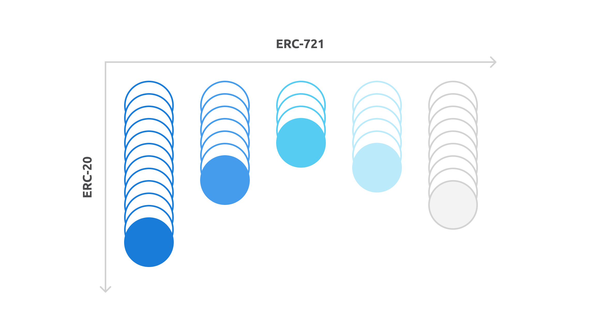
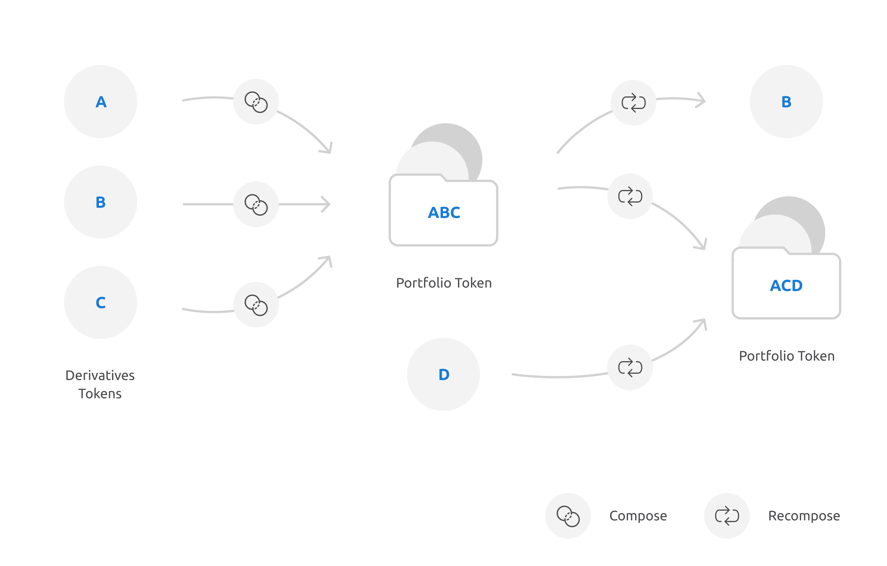

## Simple Summary
A standard interface for contracts that manage multiple token classes and compose them into new classes. A single deployed contract may include any combination of fungible tokens, non-fungible tokens and portfolios of tokens.

## Abstract
Existing standard ERC-20 only allows to represent fungible tokens of one class, thus require to deploy new contracts for every class of token. On the other hand ERC-721 has multiple classes, but there could be only one token making them non-fungible.

Proposed token standard is a combination of the ERC-20 and ERC-721 token standards with extra functionalities. It allows for batch transfer (and thus optimizing gas usage) and natively creating portfolios.

## Motivation
In financial markets, instruments can be the same and interchangeable with each other, but there are many types of different instruments. Different by maturity, underlying or standard conventions. Our inspiration to develop this token standard comes from the real financial markets, where often positions are traded in large sizes and portfolios are used to take multiple positions at once, without having the risk of 1 leg of the portfolio not being executed (see examples below). At the same time, unlike ERC-1155 token standard, proposed token standard is backward compatible with the ERC-721 token standard and thus can be traded in existing ecosystems.



Financial instruments most of the time are combined and managed as portfolios. This motivates us to create a possibility to wrap several tokens into a portfolio that is represented by one token. Once a portfolio is created, it is stored on the owner's balance and corresponding tokens are deleted from the blockchain.

We introduce three portfolio functions:
```
  Compose: creates a portfolio out of tokens

  Decompose: recreates tokens out of a portfolio

  Recompose: adds/takes several tokens to/from an existing portfolio in a gas efficient way
```

Once composed, the whole portfolio can be managed or traded as one token, saving gas and implementing convenient financial logic. 
When the portfolio decompose function is used, the tokens that were used to compose the portfolio are minted again and stored on the owners' balance.


Another function of the proposed standard is recomposing. New position tokens can be added to the existing portfolio token, but position tokens can also be taken out from the portfolio token. This function works in a gas efficient way and allows you to add/take tokens with one transaction.



## Specification

### TokenID calculation formula
We can get the ID of a portfolio token through a simple cryptographic wrap hash function: 

$$
TokenID = hash (DerivativeID + "LONG/SHORT") \quad  (1) 
\\PortfolioTokenID=hash(tokenID_1+tokenID_2+...+tokenID_N)\quad (2)
$$

### Interface
```
interface IERC721O {
  // Token description
  function name() external view returns (string memory);
  function symbol() external view returns (string memory);
  function totalSupply() public view returns (uint256);
  function exists(uint256 _tokenId) public view returns (bool);

  function implementsERC721() public pure returns (bool);
  function tokenByIndex(uint256 _index) public view returns (uint256);
  function tokenOfOwnerByIndex(address _owner, uint256 _index) public view returns (uint256 _tokenId);
  function tokenURI(uint256 _tokenId) public view returns (string memory tokenUri);
  function getApproved(uint256 _tokenId) public view returns (address);
  
  function implementsERC721O() public pure returns (bool);
  function ownerOf(uint256 _tokenId) public view returns (address _owner);
  function balanceOf(address owner) public view returns (uint256);
  function balanceOf(address _owner, uint256 _tokenId) public view returns (uint256);
  function tokensOwned(address _owner) public view returns (uint256[] memory, uint256[] memory);

  // Non-Fungible Safe Transfer From
  function safeTransferFrom(address _from, address _to, uint256 _tokenId) public;
  function safeTransferFrom(address _from, address _to, uint256 _tokenId, bytes memory _data) public;

  // Non-Fungible Unsafe Transfer From
  function transferFrom(address _from, address _to, uint256 _tokenId) public;

  // Fungible Unsafe Transfer
  function transfer(address _to, uint256 _tokenId, uint256 _quantity) public;

  // Fungible Unsafe Transfer From
  function transferFrom(address _from, address _to, uint256 _tokenId, uint256 _quantity) public;

  // Fungible Safe Transfer From
  function safeTransferFrom(address _from, address _to, uint256 _tokenId, uint256 _amount) public;
  function safeTransferFrom(address _from, address _to, uint256 _tokenId, uint256 _amount, bytes memory _data) public;

  // Fungible Safe Batch Transfer From
  function safeBatchTransferFrom(address _from, address _to, uint256[] memory _tokenIds, uint256[] memory _amounts) public;
  function safeBatchTransferFrom(address _from, address _to, uint256[] memory _tokenIds, uint256[] memory _amounts, bytes memory _data) public;

  // Fungible Unsafe Batch Transfer From
  function batchTransferFrom(address _from, address _to, uint256[] memory _tokenIds, uint256[] memory _amounts) public;

  // Approvals
  function setApprovalForAll(address _operator, bool _approved) public;
  function approve(address _to, uint256 _tokenId) public;
  function getApproved(uint256 _tokenId, address _tokenOwner) public view returns (address);
  function isApprovedForAll(address _owner, address _operator) public view returns (bool isOperator);
  function isApprovedOrOwner(address _spender, address _owner, uint256 _tokenId) public view returns (bool);
  function permit(address _holder, address _spender, uint256 _nonce, uint256 _expiry, bool _allowed, bytes calldata _signature) external;

  // Composable
  function compose(uint256[] memory _tokenIds, uint256[] memory _tokenRatio, uint256 _quantity) public;
  function decompose(uint256 _portfolioId, uint256[] memory _tokenIds, uint256[] memory _tokenRatio, uint256 _quantity) public;
  function recompose(uint256 _portfolioId, uint256[] memory _initialTokenIds, uint256[] memory _initialTokenRatio, uint256[] memory _finalTokenIds, uint256[] memory _finalTokenRatio, uint256 _quantity) public;

  // Required Events
  event Transfer(address indexed from, address indexed to, uint256 indexed tokenId);
  event TransferWithQuantity(address indexed from, address indexed to, uint256 indexed tokenId, uint256 quantity);
  event ApprovalForAll(address indexed _owner, address indexed _operator, bool _approved);
  event BatchTransfer(address indexed from, address indexed to, uint256[] tokenTypes, uint256[] amounts);
  event Composition(uint256 portfolioId, uint256[] tokenIds, uint256[] tokenRatio);
}
```

## Backwards Compatibility

### ERC-721
Transfer functions and events are backward compatible with ERC-721 so it's possible for other protocols to consider this token standard as ERC-721.

The only incompatible functions are

```
function ownerOf(uint256 _tokenId) public view returns (address);
function getApproved(uint256 _tokenId) public view returns (address);
```

Which always return either zero address (if `tokenId` doesn't exist) or address of token smart contract itself.

We were unable to make these functions backward compatible, because there is no specific owner of `tokenId` nor you can't set approvals for the whole amount of tokens by `tokenId`.

### ERC-721x
Besides the newly introduced portfolio functions, we inherited several functions from the [ERC721x](https://erc721x.org) reference implementation:

```
  transferFrom: sends a particular amount of a specific token ID from one address to another

  batchTransferFrom: allows you to send multiple non-identical tokens with different amounts in one transaction

  approve: grants someone else permission to spend any amount of a specific tokenID on the owner's behalf

  setApprovalForAll: grants someone else permission to spend any amount of any tokenID  on the owner's behalf
```

## Test Cases
E2E Tests are implemented in the repository with reference implementation.

Tests are covering Balance, Transfer, Composition and Approval part of the standard.

https://github.com/OpiumProtocol/erc721o/blob/master/test/TokenMinter.js

## Implementation
Reference implementation of the standard could be found here:

https://github.com/OpiumProtocol/erc721o/

## Security Considerations
Reference implementation was audited within Opium Protocol auditing process by [SmartDec](https://smartdec.net) and could be found in Opium Protocol repository.

## Copyright
Copyright and related rights waived via [MIT](https://github.com/OpiumProtocol/erc721o/blob/master/LICENSE.md).
