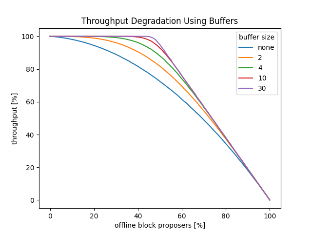
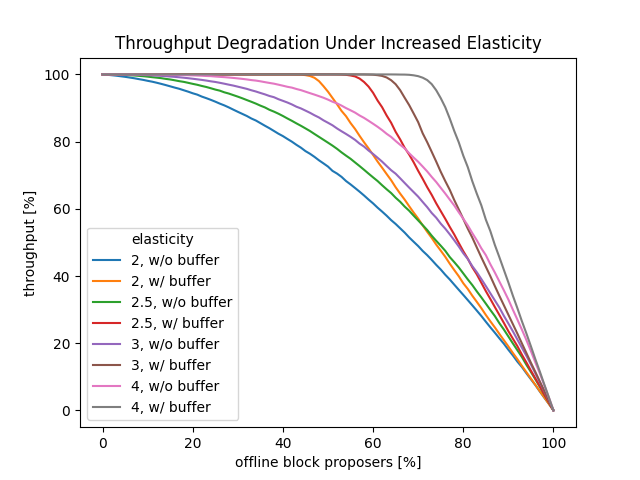

## Abstract
This EIP proposes to modify the base fee calculation to take block times into account and target a stable throughput per time instead of per block. Its aim is to keep changes to the calculation to a minimum, only introducing a variable block gas target proportional to the block time. The EIP can in principle be applied to either a proof of work or a proof of stake chain, however the security implications for the proof of work case remain unexplored. 

## Motivation

The current base fee calculation uses the gas usage of a block as the signal to determine whether current demand for block space is too high (base fee should be lowered) or too high (base fee should be increased). This choice of signal is however flawed, as it does not take the block time into account. Generally speaking, a 20s block can be expected to be twice as full as a 10s block at the same demand level, and using the same gas target for both is accordingly incorrect. In practice, there are several undesirable consequences of this flawed signal:

### Base Fee Volatility under Proof of Work

Under proof of work (PoW), block times are stochastic, and for that reason there exists a large general block time variability. This variability contributes to the base fee volatility, where the base fee can be expected to oscillate around the equilibrium value even under perfectly stable demand.

### Missed Slots

Under proof of stake (PoS), block times are generally uniform (always 12s), but missed slots lead to individual blocks with increased block time (24s, 36s, ...). Under the current update rule, such missed slots will therefore result in perceived demand spikes and thus to small unwarranted base fee spikes.

More importantly, these missed slots direcly reduce the overall throughput of the execution chain by one full block (full here meaning gas target). While the immediately following block can be expected to include the "delayed" transactions of the missed slot, the resulting base fee spike then results in subsequent under-full blocks, so that in the end the block space of the missed block is lost for the chain. 

This is particularly problematic, as it makes denial of service (DOS) attacks on block proposers a straight forward way of compromising overall chain performance.

### Throughput Degradation During Consensus Issues

A more severe version of individual missed slots can be caused by consensus issues that prevent a significant portion of block proposers from continuing to create blocks. This can be due to block proposers forking off (and creating blocks on their own fork), being unable to keep up with the current chain head for another reason, or simply being unable to create valid blocks.

In all these situations, average block times go up significantly, causing chain throughput to fall by the same fraction. While this effect is already present under PoW, the self-healing mechanism of difficulty adjustments is relatively quick to kick in and restore normal block times. Under PoS on the other hand, the automatic self-healing mechanism can be extremely slow, with potentially up to a third of missed slots for several months, or several weeks of more than a third of missed slots.

For all those reasons it would be desirable to target a stable throughput per time instead of per block, by taking block time into account during the base fee calculation.

To maximize the chance of this EIP being included in the merge fork, the adjustments are kept to a minimum, with more involved changes discussed in the rationale section.

## Specification
Using the pseudocode language of [EIP-1559](/EIPS/eip-1559.md), the updated base fee calculation becomes:

```python
...

BASE_FEE_MAX_CHANGE_DENOMINATOR = 8
BLOCK_TIME_TARGET = 12
MAX_GAS_TARGET_PERCENT = 95

class World(ABC):
    def validate_block(self, block: Block) -> None:
        parent_gas_limit = self.parent(block).gas_limit
        parent_block_time = self.parent(block).timestamp - self.parent(self.parent(block)).timestamp
        parent_base_gas_target = parent_gas_limit // ELASTICITY_MULTIPLIER
        parent_adjusted_gas_target = min(parent_base_gas_target * parent_block_time // BLOCK_TIME_TARGET, parent_gas_limit * MAX_GAS_TARGET_PERCENT // 100)
        parent_base_fee_per_gas = self.parent(block).base_fee_per_gas
        parent_gas_used = self.parent(block).gas_used

        ...

        if parent_gas_used == parent_adjusted_gas_target:
            expected_base_fee_per_gas = parent_base_fee_per_gas
        elif parent_gas_used > parent_adjusted_gas_target:
            gas_used_delta = parent_gas_used - parent_adjusted_gas_target
            base_fee_per_gas_delta = max(parent_base_fee_per_gas * gas_used_delta // parent_base_gas_target // BASE_FEE_MAX_CHANGE_DENOMINATOR, 1)
            expected_base_fee_per_gas = parent_base_fee_per_gas + base_fee_per_gas_delta
        else:
            gas_used_delta = parent_adjusted_gas_target - parent_gas_used
            base_fee_per_gas_delta = parent_base_fee_per_gas * gas_used_delta // parent_base_gas_target // BASE_FEE_MAX_CHANGE_DENOMINATOR
            expected_base_fee_per_gas = parent_base_fee_per_gas - base_fee_per_gas_delta
        
        ...

    ...
```

## Rationale

### Design Choices

- include block time in base fee adjustment: make "block gas target" proportional to block time
- results in control loop that targets stable throughput per time
- addresses problems listed above:
    - reduces / removes base fee volatility inroduced by PoW block time variability
    - reduces / removes base fee volatility inroduced by PoS missed slots
    - reduces incentive to DOS block proposers
    - reduces / removes impact of chain forks on throughput
- drawback: during demand spikes under PoS, missed slots can delay base fee increase


### Future Changes





- exponential base fee update
    - more elegant properties
    - slightly more involved change to include efficient deterministic exponentiation

## Backwards Compatibility

The EIP has minimal impact on backwards compatibility, only requiring updates to existing base fee calculation tooling.

## Test Cases
tbd

## Reference Implementation
tbd

## Security Considerations

### Timestamp Manipulation

Under PoW, miners are in control over the timestamp field of their blocks. While there are some enforced limits to valid timestamps, implications regarding potential timestamp manipulation are nontrivial and remain unexplored for this EIP.

Under PoS, each slot has a [fixed assigned timestamp](https://github.com/ethereum/consensus-specs/blob/v1.1.3/specs/merge/beacon-chain.md#process_execution_payload), rendering any timestamp manipulation by block proposers impossible.

### Suppressing Base Fee Increases
As discussed in the rationale, a high value for `MAX_GAS_TARGET_PERCENT` during times of many offline block proposers results in a small remaining signal space for genuine demand increases that should result in base fee increases. This in turn decreases the cost for block proposers for suppresing these base fee increases, instead forcing the fallback to a first-price priority fee auction.

While the arguments of incentive incompatibility for base fee suppression of the the base EIP-1559 case still apply here, with a decreasing cost of this individually irrational behavior the risk for overriding psychological factors becomes more significant.

Even in such a case the system degradation would however be graceful, as it would only temporarily suspend the base fee burn. As soon as the missing block proposers would come back online, the system would return to its ordinary EIP-1559 equilibrium.

## Copyright
Copyright and related rights waived via [CC0](https://creativecommons.org/publicdomain/zero/1.0/).
