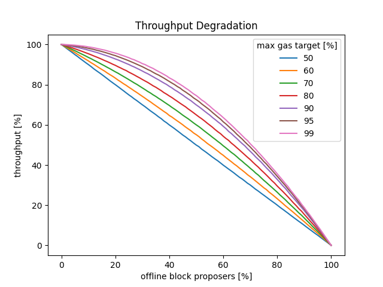

## Abstract
Abstract is a multi-sentence (short paragraph) technical summary. This should be a very terse and human-readable version of the specification section. Someone should be able to read only the abstract to get the gist of what this specification does.

## Motivation
- current EIP-1559 base fee adjustment: based on block gas usage
- in effect, control loop that targets stable throughput per block
- not ideal under PoW under two aspects:
    - block time variability:
        - block gas usage tries to measure demand at current base fee level, but gas usage is proportional to block time, introducing noise to the used signal
        - block time variability => "incorrect" demand signals => "incorrect" base fee adjustments => increased base fee volatility
    - reduced throughput during consensus issues:
        - if chain forks, block times go up for a while, before difficulty is adjusted
        - gas limit elasticity would give us the capability to compensate for this throughput reduction to some extent
- also not ideal under PoS:
    - missed slots:
        - while general block times become regular, occasionally slots are missed, doubling the block time for the next block (or more, if that slot is also missed)
        - missed slots still send incorrect signal (demand looks 2x as high as it is), leading to base fee spikes after missed slots
        - incentive to attack network via block proposer DOS, as each missed slot directly reduces network throughput
    - consensus issues:
        - worse than under PoW, as longer time for self-healing (several weeks for inactivity leaks as opposed to several hours for difficulty adjustments)
        - gas limit elasticity would again give us the capability to compensate for this throughput reduction to some extent

## Specification
Using the pseudocode language of [EIP-1559](/EIPS/eip-1559.md), the updated base fee calculation becomes:

```python
...

BASE_FEE_MAX_CHANGE_DENOMINATOR = 8
BLOCK_TIME_TARGET = 12
MAX_GAS_TARGET_PERCENT = 95

class World(ABC):
    def validate_block(self, block: Block) -> None:
        parent_gas_limit = self.parent(block).gas_limit
        parent_block_time = self.parent(block).timestamp - self.parent(self.parent(block)).timestamp
        parent_base_gas_target = parent_gas_limit // ELASTICITY_MULTIPLIER
        parent_adjusted_gas_target = min(parent_base_gas_target * parent_block_time // BLOCK_TIME_TARGET, parent_gas_limit * MAX_GAS_TARGET_PERCENT // 100)
        parent_base_fee_per_gas = self.parent(block).base_fee_per_gas
        parent_gas_used = self.parent(block).gas_used

        ...

        if parent_gas_used == parent_adjusted_gas_target:
            expected_base_fee_per_gas = parent_base_fee_per_gas
        elif parent_gas_used > parent_adjusted_gas_target:
            gas_used_delta = parent_gas_used - parent_adjusted_gas_target
            base_fee_per_gas_delta = max(parent_base_fee_per_gas * gas_used_delta // parent_base_gas_target // BASE_FEE_MAX_CHANGE_DENOMINATOR, 1)
            expected_base_fee_per_gas = parent_base_fee_per_gas + base_fee_per_gas_delta
        else:
            gas_used_delta = parent_adjusted_gas_target - parent_gas_used
            base_fee_per_gas_delta = parent_base_fee_per_gas * gas_used_delta // parent_base_gas_target // BASE_FEE_MAX_CHANGE_DENOMINATOR
            expected_base_fee_per_gas = parent_base_fee_per_gas - base_fee_per_gas_delta
        
        ...

    ...
```

## Rationale

### Design Choices

- include block time in base fee adjustment: make "block gas target" proportional to block time
- results in control loop that targets stable throughput per time
- addresses problems listed above:
    - reduces / removes base fee volatility inroduced by PoW block time variability
    - reduces / removes base fee volatility inroduced by PoS missed slots
    - reduces incentive to DOS block proposers
    - reduces / removes impact of chain forks on throughput
- drawback: during demand spikes under PoS, missed slots can delay base fee increase



### Future Changes


- exponential base fee update
    - more elegant properties
    - slightly more involved change to include efficient deterministic exponentiation

## Backwards Compatibility
- only small adjustments to existing base fee calculation tooling

## Test Cases
tbd

## Reference Implementation
tbd

## Security Considerations
- timestamp manipulation
- easier to suppress base fee increase => higher miner collaboration incentive

## Copyright
Copyright and related rights waived via [CC0](https://creativecommons.org/publicdomain/zero/1.0/).
